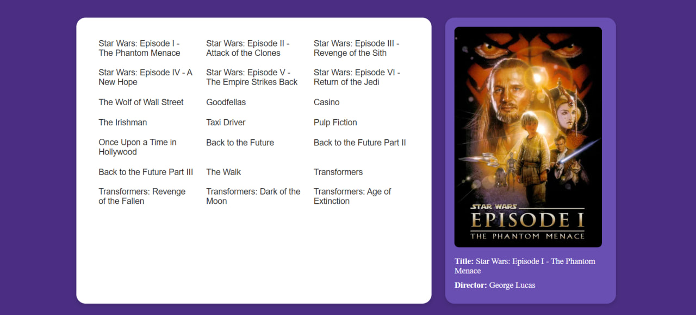

# Kirs_Mikhail_Laravel_API

## Best Movies Of The Greatest Directors API

## Overview  
This project is a custom Laravel API that provides movie data to a frontend application. Instead of using static content, the API allows data to be requested dynamically, which makes the project more interactive and structured.

The goal of this project was to build a backend that can store, manage, and return movie data in a clean and organized way. This API is used by a separate frontend project where the data is displayed and interacted with.

## Project Purpose  

The purpose of this project was to practice building an API using Laravel and understand how data flows between the database and the frontend. It also helped me improve how I structure and manage data inside a project.

## Backend Structure (Laravel)

The backend was built using Laravel.

I started by creating the database structure using migrations, where I defined tables for movies and directors. Then I created models to represent the data and controllers to handle how the data is returned and updated.

I set up API routes to handle requests for movies, including getting all movies and getting a single movie with details. I also worked with relationships between movies and directors.

To populate the database, I used seeders and factories to insert my custom movie data. This included titles, directors and image_url paths, which are later used on the frontend.

**Frontend API project**

- [Frontend API project](https://github.com/Mikki667/Kirs_M_HW3)

---

## Features  

- Migrations  
- Models  
- Controllers  
- Seeders  
- Factories  
- Routes  
- Relationships  
- image_url field  

## Tech Stack  

- Laravel  
- PHP  
- MySQL  
- Eloquent ORM  

## Commit History  

**Note: for both of my classes I was keeping the notes on my google docs in order to document my work properly**

# PHP Update: created laravel folder structure and connected the db

In this commit I set up the Laravel and connected it to the database. At first I had a problem because I was running commands in the wrong folder, so Laravel could not find the artisan file. I fixed it by going inside the laravel folder and then everything started working.Then I also had an issue with migrations. MySQL was giving an error about key length being too long when creating the users table. I fixed it by clearing config and running a fresh migration, and after that the tables were created successfully. So in the end Laravel is running and the database connection works.

# PHP Update: created movies and directors tables, models and connected them

In this commit I created movies and directors tables, added models, and connected them using relationships. The idea is that director can have many movies and each movie belongs to a director. I also decided to go with my theme of movies and directors for this project. I ran migrations and everything worked correctly.

# PHP Update: created seeders for movies and directors

In this commit I added the seeders for movies and directors, but left them empty. For the next step I will add there my own custom data. 

# PHP Update: added custom data for seeders for movies and directors

In this commit I added custom data to the seeders for movies and directors. I decided to go with this way instead of using random generated data, because I wanted to make it more personal. I decided to manually add it, and, of course these are the movies I actually like. I connected my seeders in DatabaseSeeder so they are actually connected.  Lastly, I ran the migrations with seeders and everything worked the way I needed it to.

# PHP Update: added MovieController and movies route

In this commit I added the “MovieController” with all the main functions like index, show, store, update and destroy. I followed the class example and adapted it for my project. I also added a route for the movies and tested my API which showed me the data I added into seeders. Everything worked properly.

# PHP Update: added API routes for movies

In this commit I added API routes for movies including index, show, store, update and destroy. I connected them to the moviecontroller and tested them in the browser. 

# PHP Update: Director Factory was created

In this commit I changed the way I implemented my custom data by adding a factory for directors. At first I changed the structure inside of a seeder for directors, and after that I created a factory itself. 
PHP Update: Movie Factory was created

In this commit the same way as I did with my custom data for directors I changed the structure of my data from just “create” to “factory”. Additionally, I created a factory for movies and slightly modified it by adding a check for the directors id, so the code will not break.

# PHP Update: DirectorController was created

In this commit I created a controller for the directors by also adding an “index” function and creating a route for it as well. 

# PHP Update: Show function and the route for DirectorController were created 

In this commit I created a show function for the directorcontroller and also a route for it. After testing I checked everything and it works. 

# PHP Update: Store function was added for the director controller

In this commit I added a “store” function for my directors controller and also a route for it. 

# PHP Update: Update function for the directors controller was added

In this commit I added the function “update” for my directorcontroller as well as the route for it. 
PHP Update: Destroy function was created 

In this commit I added the destroy function as well as the route for my director controller. 

# PHP Update: Added image_url column to movies table

In this commit I created a new migration to add an image_url column to the movies table. This allows storing image paths for each movie.I also made the column nullable so nothing will break if a movie does not have an image yet.

# PHP Update: “image_url” was added to the movie seeder

In this commit I updated my movie seeder with the “image_url”. Additionally I added all of the images inside an “images/movies” folder in “public”. The images for the movie posters were taken from - https://www.themoviedb.org/ 

# PHP Update: naming correction

In this commit I fixed the typo mistake in the name of “The Wolf Of Wall St.” movie.

# PHP Update: naming correction 2

In this commit I fixed the typo mistake in the name of “The Wolf Of Wall St.” movie.

# README file Update

In this commit I added my readme file that I was working on throughout the process of doing both of the assignments for both of the classes. 

## Workflow  

This project was built step by step based on the class example and then adapted into my own movie idea. I started by setting up Laravel and creating migrations for the database structure. After that, I created models and controllers to handle the movie data and set up API routes.

Once the basic structure was working, I added relationships between movies and directors and used seeders and factories to populate the database with my custom movie list. I also added image_url paths so the frontend could display movie images.

Finally, I tested the API endpoints to make sure the data was being returned correctly and could be used by the frontend.

## AI Tools Used  

At first I started doing my own research where I used ChatGPT to help me analyse the class build. It explained the commands, models, seeders and other parts of the project, which helped me better understand how everything works together. I then applied that understanding while building my own version of the project.

## Installation  

To run this project locally:

1. Clone the repository  
2. Install Git Bash 
3. Navigate to the project folder
4. Write php artisan migrate:fresh --seed
5. php artisan serve

## Credits  
Mikhail Kirs  

## License  
MIT License  

**Contact:**  
- [topkun6666@gmail.com](mailto:topkun6666@gmail.com)  
- +1 (226) 224-6074  
- [GitHub Profile](https://github.com/Mikki667)  
- [My Portfolio](https://michaelkirsweb.ca/)  

